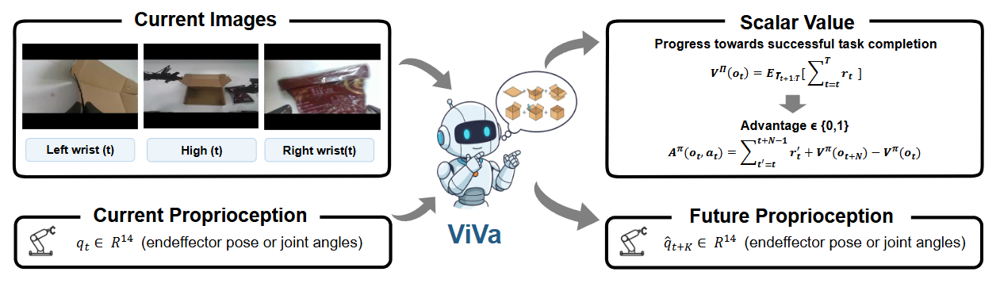

# ⚖️ ViVa: A Video-Generative Value Model for Robot Reinforcement Learning

[](http://arxiv.org/abs/2604.08168)
[](https://viva-value-model.github.io/)


This is the official implementation of the paper: [ViVa: A Video-Generative Value Model for Robot Reinforcement Learning.](http://arxiv.org/abs/2604.08168)

## ✅ Updates

- `2026.4.13`: The code is released.

## 📋 Overview

<div align="center">


<p><em>Overview of ViVa. Given the current multi-view observations and robot proprioception, ViVa jointly predicts the future proprioceptive state and a scalar value representing task progress toward successful completion.</em></p>

</div>


> **Abstract:** Vision-language-action (VLA) models have advanced robot manipulation through large-scale pretraining, but real-world deployment remains challenging due to partial observability and delayed feedback. Reinforcement learning addresses this via value functions, which assess task progress and guide policy improvement. However, existing value models built on vision-language models (VLMs) struggle to capture temporal dynamics, undermining reliable value estimation in long-horizon tasks. In this paper, we propose ViVa, a video-generative value model that repurposes a pretrained video generator for value estimation. Taking the current observation and robot proprioception as input, ViVa jointly predicts future proprioception and a scalar value for the current state. By leveraging the spatiotemporal priors of a pretrained video generator, our approach grounds value estimation in anticipated embodiment dynamics, moving beyond static snapshots to intrinsically couple value with foresight. Integrated into RECAP, ViVa delivers substantial improvements on real-world box assembly. Qualitative analysis across all three tasks confirms that ViVa produces more reliable value signals, accurately reflecting task progress. By leveraging spatiotemporal priors from video corpora, ViVa also generalizes to novel objects, highlighting the promise of video-generative models for value estimation.


## 🖼️ Visualization


**In-domain**

https://github.com/user-attachments/assets/ebdbdf25-7a9d-45a1-ae4e-380b69e3298f

**Out-of-domain**

https://github.com/user-attachments/assets/1f6fe1da-114e-4f58-8640-a00dcc5db10e


## 🛠 Installation

```bash
# 1. Create and activate the conda environment
conda create -n viva python=3.11.10 -y
conda activate viva

# 2. Install dependencies
pip install -r requirements.txt

# 3. Install flash-attn
pip install flash-attn==2.7.4.post1 --no-build-isolation
```


## 🚀 Quick Start

### 1. WAN Pretrained Weights

Download the 2.2-TI2V-5B weights and place them under weights/:
```bash
huggingface-cli download Wan-AI/Wan2.2-TI2V-5B --local-dir weights/Wan2.2-TI2V-5B --local-dir-use-symlinks False
```

### 2. T5 Embedding
After configuring the LeRobot dataset path and model weights path, generate offline T5 embeddings for task descriptions:

```bash
python get_text_embedding.py
```

### 3. Training

Ensure the LeRobot dataset path and T5 embedding path are correctly set, then launch the training process.

```bash
bash train_3task.sh
```

### 4. Inference


## 📝 Citation

If you find our work useful in your research, please consider citing our paper:

```bibtex
@article{viva2026,
  title={ViVa: A Video-Generative Value Model for Robot Reinforcement Learning},
  author={Lv, Jindi and Li, Hao and Li, Jie and Nie, Yifei and Kong, Fankun and Wang, Yang and Wang, Xiaofeng and Zhu, Zheng and Ni, Chaojun and Deng, Qiuping and Li, Hengtao and Lv, Jiancheng and Huang, Guan},
  year={2026},
  url={http://arxiv.org/abs/2604.08168}
}
```
